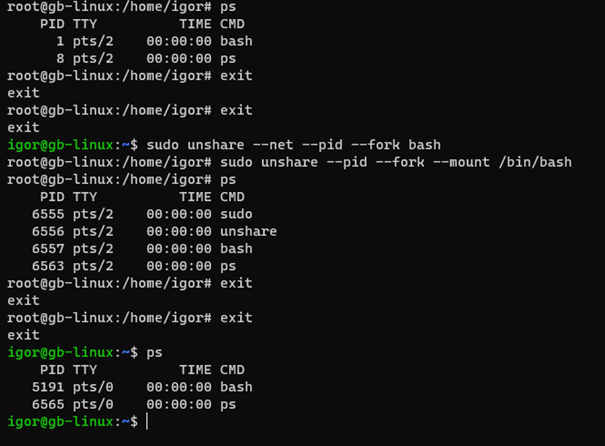

# Пространство имен NET

1. root@gb-linux:/home/igor# unshare --net bash

2. root@gb-linux:/home/igor# ip a

  1: lo: <LOOPBACK> mtu 65536 qdisc noop state DOWN group default qlen 
  1000
    link/loopback 00:00:00:00:00:00 brd 00:00:00:00:00:00

3. root@gb-linux:/home/igor#

4. root@gb-linux:/home/igor# exit
exit
5. igor@gb-linux:~$ ip a

1: lo: <LOOPBACK,UP,LOWER_UP> mtu 65536 qdisc noqueue state UNKNOWN group default qlen 1000
    link/loopback 00:00:00:00:00:00 brd 00:00:00:00:00:00
    inet 127.0.0.1/8 scope host lo
       valid_lft forever preferred_lft forever
    inet6 ::1/128 scope host
       valid_lft forever preferred_lft forever

2: enp0s3: <BROADCAST,MULTICAST,UP,LOWER_UP> mtu 1500 qdisc fq_codel state UP group default qlen 1000
    link/ether 08:00:27:7d:1e:4e brd ff:ff:ff:ff:ff:ff
    inet 10.0.2.15/24 brd 10.0.2.255 scope global dynamic noprefixroute enp0s3
       valid_lft 85603sec preferred_lft 85603sec

3: enp0s8: <BROADCAST,MULTICAST,UP,LOWER_UP> mtu 1500 qdisc fq_codel state UP group default qlen 1000
    link/ether 08:00:27:e2:ee:ae brd ff:ff:ff:ff:ff:ff
    inet 192.168.2.229/24 brd 192.168.2.255 scope global dynamic noprefixroute enp0s8
       valid_lft 1813603sec preferred_lft 1813603sec
    inet6 2003:ca:6f30:1d9a:9821:9745:e9:3de4/64 scope global temporary dynamic
       valid_lft 172789sec preferred_lft 85083sec
    inet6 2003:ca:6f30:1d9a:eb01:599:b017:6101/64 scope global dynamic mngtmpaddr noprefixroute
       valid_lft 172789sec preferred_lft 86389sec
    inet6 fe80::b44a:95f:e9a2:1d3/64 scope link noprefixroute
       valid_lft forever preferred_lft forever

4: br-fde8a2ccd17e: <NO-CARRIER,BROADCAST,MULTICAST,UP> mtu 1500 qdisc noqueue state DOWN group default
    link/ether 02:42:91:48:fe:78 brd ff:ff:ff:ff:ff:ff
    inet 172.20.0.1/16 brd 172.20.255.255 scope global br-fde8a2ccd17e
       valid_lft forever preferred_lft forever

5: br-2de8c2f585c3: <NO-CARRIER,BROADCAST,MULTICAST,UP> mtu 1500 qdisc noqueue state DOWN group default
    link/ether 02:42:8b:b9:03:cf brd ff:ff:ff:ff:ff:ff
    inet 172.19.0.1/16 brd 172.19.255.255 scope global br-2de8c2f585c3
       valid_lft forever preferred_lft forever

6: docker0: <NO-CARRIER,BROADCAST,MULTICAST,UP> mtu 1500 qdisc noqueue state DOWN group default
    link/ether 02:42:de:5c:33:aa brd ff:ff:ff:ff:ff:ff
    inet 172.17.0.1/16 brd 172.17.255.255 scope global docker0
       valid_lft forever preferred_lft forever

7: br-6ace89145334: <NO-CARRIER,BROADCAST,MULTICAST,UP> mtu 1500 qdisc noqueue state DOWN group default
    link/ether 02:42:27:17:71:e8 brd ff:ff:ff:ff:ff:ff
    inet 172.18.0.1/16 brd 172.18.255.255 scope global br-6ace89145334
       valid_lft forever preferred_lft forever

8: br-6f6c9006edc9: <NO-CARRIER,BROADCAST,MULTICAST,UP> mtu 1500 qdisc noqueue state DOWN group default
    link/ether 02:42:15:6d:f4:33 brd ff:ff:ff:ff:ff:ff
    inet 172.21.0.1/16 brd 172.21.255.255 scope global br-6f6c9006edc9
       valid_lft forever preferred_lft forever

После выполнения команды **'unshare --net bash'**, происходит создание нового сетевого пространства имен (network namespace).
Перед выполнением этой команды, вывод команды **'ip a'** показывает список доступных сетевых интерфейсов в глобальном сетевом пространстве имен (root namespace). После выполнения команды **'unshare --net bash'**, запускается новый экземпляр оболочки Bash в изолированном сетевом пространстве имен.
В новом сетевом пространстве имен показан только петлевой интерфейс **'lo'**. Это ожидаемо, так как новое сетевое пространство имен изолировано от глобального пространства имен и не наследует его сетевых интерфейсов.
Когда выходите из нового экземпляра оболочки (**'exit'**), возвращаетесь в исходное глобальное сетевое пространство имен, где снова видны все доступные сетевые интерфейсы (петлевой интерфейс **'lo'**, **'enp0s3'**, **'enp0s8'** и т.д.).

Таким образом, выполнение команды **'unshare --net bash'** создает изолированное сетевое пространство имен, в котором доступны только петлевой интерфейс **'lo'**, а остальные сетевые интерфейсы не видны.

## Пространство имен PID

1. В первом блоке команд мы были в режиме "root". Выполнив команду "sudo unshare --fork --pid --mount-proc /bin/bash", мы создали новый процесс оболочки Bash в изолированном пространстве имен. В этом пространстве имен у вас есть только интерфейс петли ("lo"), и команда "ps" отображает только процессы, принадлежащие текущему изолированному пространству имен.

2. После ввода команды "exit" дважды, вы вернулись в глобальное пространство имен и стали пользователем "igor". Команда "ps" отображает только процессы, принадлежащие текущему глобальному пространству имен.

3. Затем вы выполнили команду "sudo unshare --net --pid --fork bash", которая создала новое изолированное пространство имен, включая пространство имен сети. Выполнив команду "sudo unshare --pid --fork --mount /bin/bash", вы создали ещё одно изолированное пространство имен, на этот раз без пространства имен сети. Команда "ps" отображает процессы, принадлежащие каждому из созданных изолированных пространств имен.

4. После ввода команды "exit" дважды, вы снова вернулись в глобальное пространство имен и стали пользователем "igor". Команда "ps" отображает только процессы, принадлежащие текущему глобальному пространству имен.

Процессы внутри каждого пространства имен видят и могут взаимодействовать только с другими процессами в том же пространстве имен. Каждое пространство имен имеет свою уникальную нумерацию, начиная с 1. Если процесс с номером 1 исчезает, то все пространство имен также удаляется. Пространства имен могут быть вложенными, поэтому у процесса может быть несколько номеров. Для своей работы команды типа "ps" используют специальную виртуальную файловую систему procfs.

   

